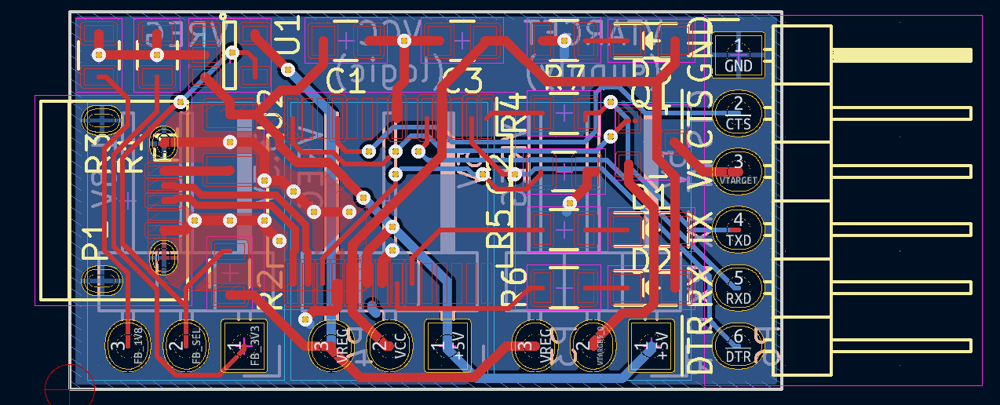
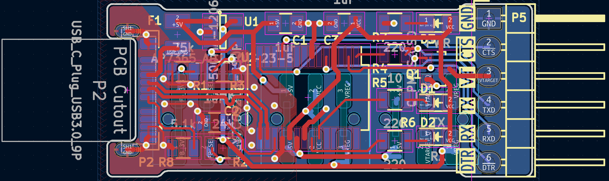
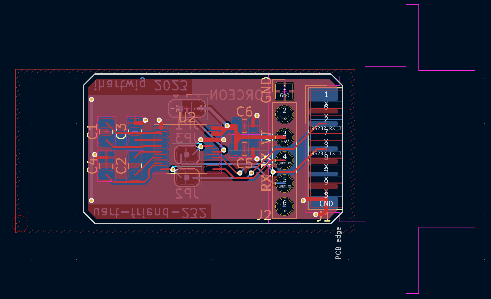
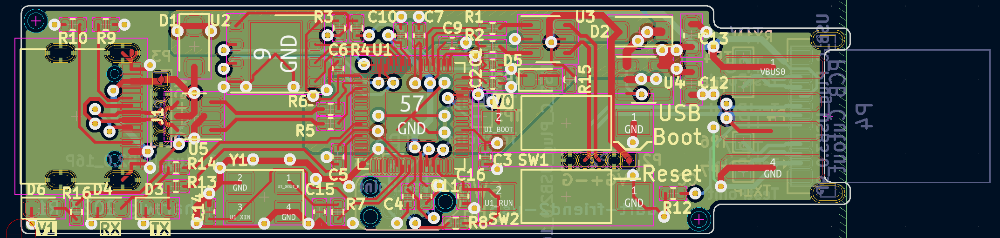
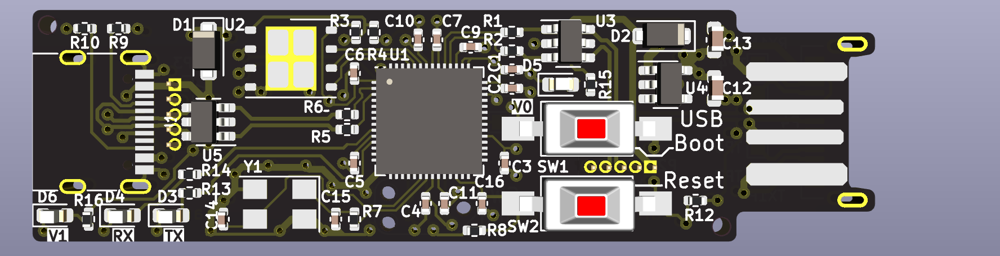

# uart-friend(s)

A collection of USB-UART adapters and adapter-adapters

[uart-friend](uart-friend): FTDI Friend like Micro-USB to TTL-UART bridge based on the CY7C65213 (or FT232R)
 

[uart-friend-c](uart-friend-c): USB-C plug verison of uart-friend - look, no cables!
 

[uart-friend-232](uart-friend-232): An RS232 levels and connector adapter for uart-friend
 

[uart-friend2-usb](uart-friend2-usb): A 2-usb-port RP2040 dev board to create a virtual uart bridge with usb
 
 

[swd-pogo-pins](swd-pogo-pins): (WIP) Adapter for TC2030 like footprint to for SPI programming

The projects in this repository need KiCAD 7 or later to open them.

